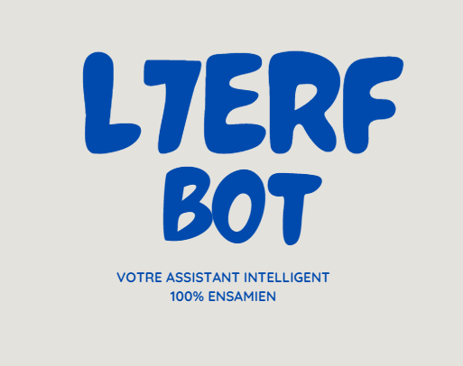
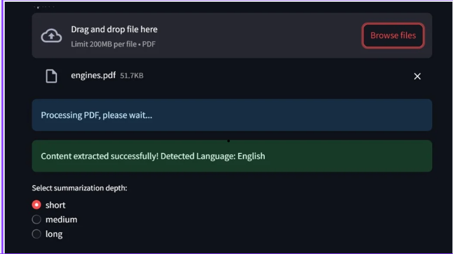
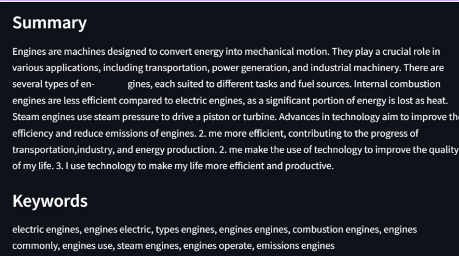
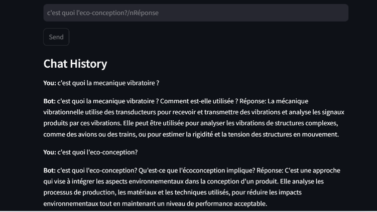

.. image::image_2024-12-24_164802934.png
   :alt: L7erf Bot Logo
   :width: 200px
   :align: center

Welcome to L7erf Bot's Documentation!
======================================

Welcome to the official documentation for **L7erf Bot**, your intelligent AI assistant designed to simplify learning, automate complex tasks, and provide unmatched support. Whether you're a student seeking clarity, an educator streamlining your workload, or a researcher diving into data, **L7erf Bot** is your reliable partner.

---

Why L7erf Bot?
==============

In today’s fast-paced world, managing information efficiently is more crucial than ever. **L7erf Bot** is built to address this need by combining cutting-edge technology with user-focused design.  

Here's why **L7erf Bot** stands out:  

- **🌍 Multilingual Support**  
  Seamlessly processes and interacts in multiple languages, breaking down barriers in communication and learning.  

- **⚡ Instant Responses**  
  Powered by the **BLOOM-560M** model, delivering highly accurate answers at lightning speed.  

- **🎯 Task-Oriented Design**  
  Specially tailored to meet academic and professional requirements, making it more than just a chatbot—it’s your personal assistant.  

- **🔧 Customizable Framework**  
  Easily adaptable for additional features or integrations to suit your unique needs.  

---

Core Features
=============

- **📄 Advanced PDF Summarization**  
  Struggling with lengthy documents? L7erf Bot processes and summarizes PDFs efficiently, offering:  
  - Key highlights and insights extracted from dense academic or professional materials.  
  - Support for unstructured text and multiple languages, making it universally useful.  

- **🎓 ENSAM Meknès Guide**  
  A specialized resource for ENSAM Meknès students, covering:  
  - Academic programs, campus life, and extracurricular activities.  
  - Administrative queries like registration, schedules, and contacts—all in one place.  

- **🤖 Intelligent Chat Features**  
  Ask questions and receive clear, accurate, and concise responses. The chatbot is fine-tuned for:  
  - Academic topics, including engineering, AI, and more.  
  - General knowledge and problem-solving tasks.  

---

Behind the Bot
==============

**✨ Developed By:** Jouak Bouthayna & Hajar El Hadri  

**📅 Release Date:** December 15, 2024  
**🏆 Our Mission:** To revolutionize access to knowledge through the power of artificial intelligence.  

L7erf Bot is powered by advanced NLP models, robust Streamlit frameworks, and a commitment to seamless user experiences.  

---

Documentation Overview
======================

This documentation serves as your one-stop guide for everything related to **L7erf Bot**. Whether you’re a beginner setting it up for the first time or a developer looking to customize its features, this guide has you covered.  

Here’s what you’ll find inside:  

- **Installation Instructions**  
  A detailed walkthrough for setting up the bot and its dependencies.  

- **How-To Guides**  
  Practical tips and examples to make the most out of L7erf Bot’s features.  

- **Architecture Insights**  
  Dive into the technical backbone of the bot, including NLP models, deployment strategies, and system design.  

- **API Documentation**  
  For developers looking to integrate or extend the bot’s capabilities.  

- **Troubleshooting Resources**  
  Find quick solutions to common problems encountered during setup or use.  

---

Documentation Contents
======================

.. toctree::
   :maxdepth: 2
   :caption: Navigate the Documentation:

   installation
       Learn how to set up L7erf Bot and its dependencies.
   usage
       Discover practical examples and tips for using the bot effectively.
   features
       A comprehensive guide to all the bot's capabilities.
   api
       Technical reference for developers to extend or integrate the bot.
   architecture
       An in-depth look at the system's design and AI technologies.
   troubleshooting
       Quick fixes for setup or runtime issues.
   future_plans
       Explore the roadmap for upcoming features and enhancements.
   credits
       Acknowledgments and references for the project.

---

Get Started
===========

Unlock the full potential of **L7erf Bot**! Start by exploring the documentation to:  

1. **Install and Configure**  
   Set up L7erf Bot on your machine with ease.  

2. **Understand the Features**  
   Dive into the detailed usage guide for practical examples.  

3. **Contribute or Extend**  
   Developers can leverage the API and architecture sections to integrate custom functionalities.  

4. **Resolve Issues Quickly**  
   Access troubleshooting guides to overcome any obstacles.  

---

Ready to take your learning, teaching, or research to the next level?  
Let’s get started and make AI work for you!
